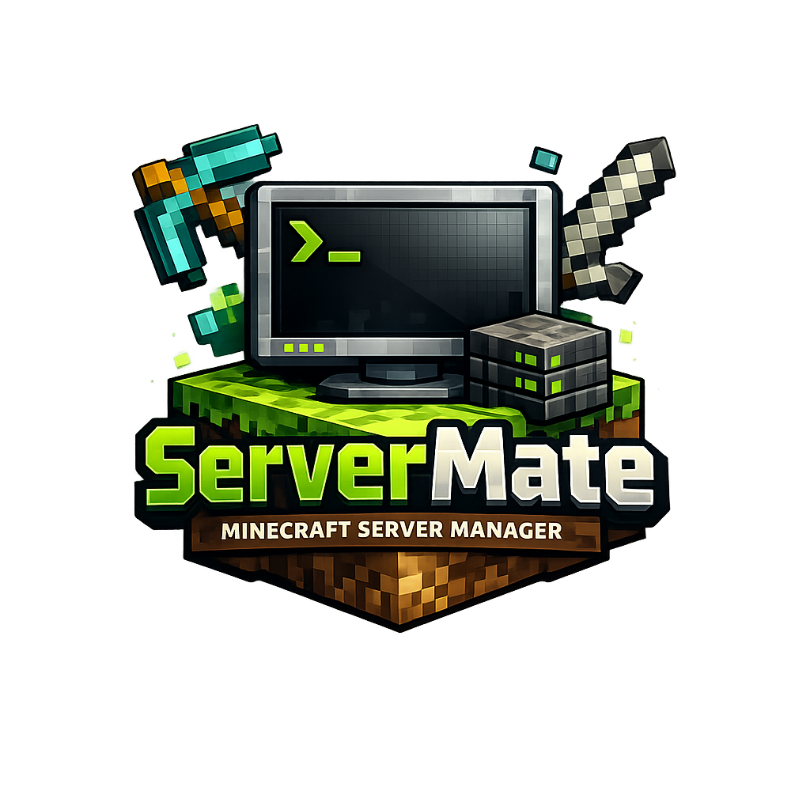

<div align="center">



# ServerMate

**Minecraft server manager for Windows & Linux**

[English](#english) · [Русский](#русский)

</div>

---

## English

ServerMate is a desktop application for managing Minecraft servers — create, configure, and run them without touching the terminal.

### Features

- **One-click launch** — start and stop servers with a single button
- **Console** — full server console with command input, quick commands bar, and scheduled restarts
- **Overview** — live stats: RAM usage, uptime, online players, server address
- **Players** — manage whitelist, ops, bans, banned IPs; see who's online with heads
- **Worlds** — list worlds with size, delete unused ones
- **Plugins / Mods** — browse, enable/disable, delete; edit plugin configs inline
- **Plugin market** — search and install plugins from Modrinth
- **Backups** — create and manage world backups as ZIP archives
- **Crash reports** — view crash-reports with parsed description and stack trace
- **Java** — auto-detects installed Java, installs the right version if missing
- **Import / Export** — import existing server folders, export server as ZIP
- **Autostart** — automatically start a server when the app launches
- **Tray** — minimize to system tray, server keeps running in background

### Download

Go to [Releases](../../releases) and download:

| File | Description |
|------|-------------|
| `ServerMate-x.x.x-setup.exe` | Windows installer |
| `ServerMate-x.x.x-portable.exe` | Windows portable (no install needed) |
| `ServerMate-x.x.x-x64.AppImage` | Linux AppImage |
| `ServerMate-x.x.x-amd64.deb` | Linux Debian/Ubuntu package |

### Requirements

- Windows 10+ or Linux (Ubuntu 22.04+, Debian 11+)
- Java 17+ (ServerMate can install it automatically)
- Internet connection for downloading server JARs

### Build from source

```bash
git clone https://github.com/lonestill/ServerMate.git
cd ServerMate
npm install
npm run dev        # development
npm run dist:all   # build installer + portable
```

---

## Русский

ServerMate — десктопное приложение для управления Minecraft серверами. Создавай, настраивай и запускай серверы без командной строки.

### Возможности

- **Запуск в один клик** — старт и остановка сервера одной кнопкой
- **Консоль** — полная консоль сервера с вводом команд, быстрыми командами и запланированным перезапуском
- **Обзор** — живые метрики: использование RAM, аптайм, игроки онлайн, адрес сервера
- **Игроки** — управление вайтлистом, операторами, банами и IP-банами; список онлайн с головами игроков
- **Миры** — список миров с размером, удаление ненужных
- **Плагины / Моды** — просмотр, включение/отключение, удаление; редактирование конфигов прямо в приложении
- **Маркет** — поиск и установка плагинов с Modrinth
- **Бэкапы** — создание и управление бэкапами мира в ZIP
- **Краши** — просмотр crash-report'ов с описанием ошибки и стектрейсом
- **Java** — автоопределение установленной Java, автоустановка нужной версии при отсутствии
- **Импорт / Экспорт** — импорт существующих папок сервера, экспорт сервера в ZIP
- **Автозапуск** — автоматический старт сервера при запуске приложения
- **Трей** — сворачивание в системный трей, сервер продолжает работать в фоне

### Скачать

Перейди в [Releases](../../releases) и скачай:

| Файл | Описание |
|------|----------|
| `ServerMate-x.x.x-setup.exe` | Установщик для Windows |
| `ServerMate-x.x.x-portable.exe` | Portable для Windows (без установки) |
| `ServerMate-x.x.x-x64.AppImage` | Linux AppImage |
| `ServerMate-x.x.x-amd64.deb` | Пакет для Debian/Ubuntu |

### Требования

- Windows 10+ или Linux (Ubuntu 22.04+, Debian 11+)
- Java 17+ (ServerMate может установить автоматически)
- Интернет для скачивания серверных JAR-файлов

### Сборка из исходников

```bash
git clone https://github.com/lonestill/ServerMate.git
cd ServerMate
npm install
npm run dev        # разработка
npm run dist:all   # сборка установщика + portable
```

---

<div align="center">
MIT License
</div>
